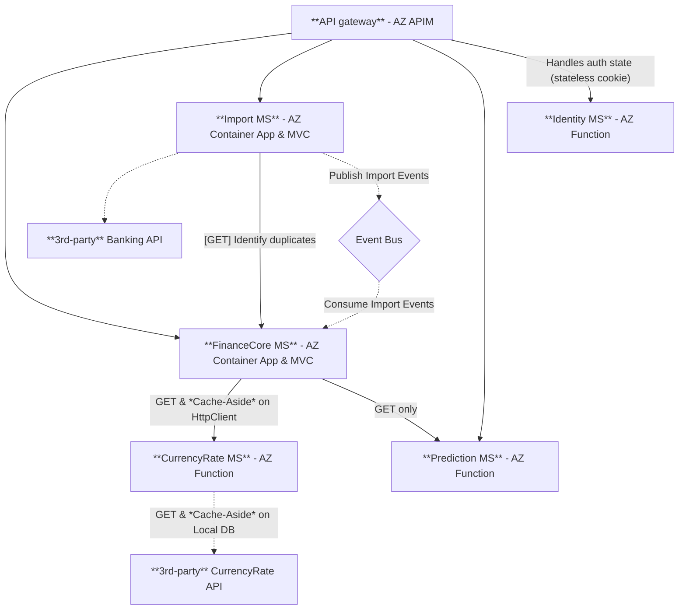
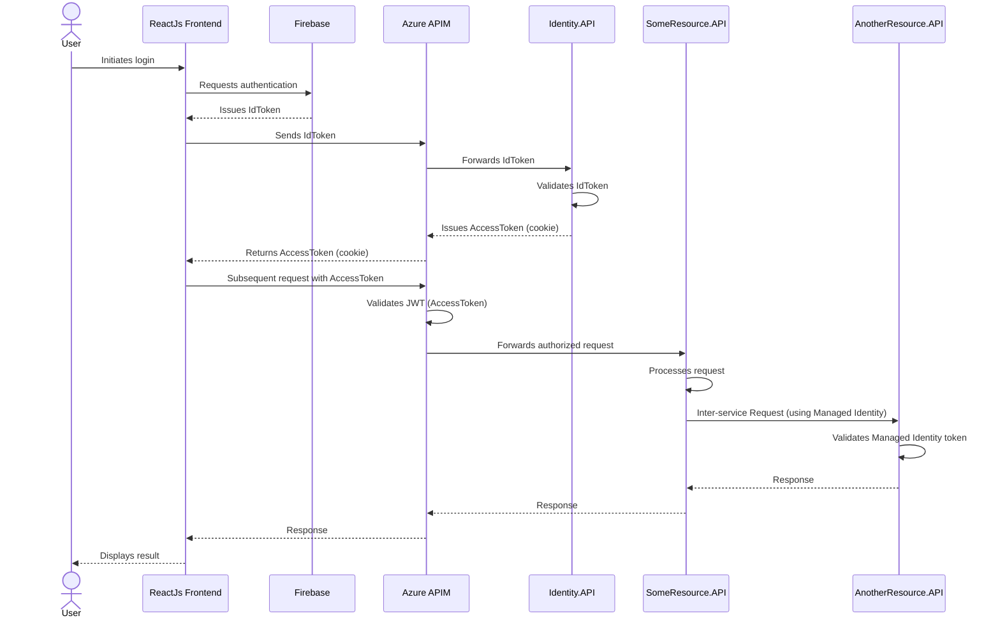

## MoneyCanFly API - MicroServices

This API is a rework of an already working NextJS API [here](https://github.com/armandasalmd/money-can-fly/tree/production/src/pages/api). Existing API idea has been selected for rework as its Business domain creates a well-rounded set of challenges to practice for Microservices architecture (`C#.NET`).
Have a look at DB entities [here](https://github.com/armandasalmd/money-can-fly/tree/production/src/server/models/mongo) for a summary picture.

#### Step 1. Breaking down existing monolith

Existing app [here](https://github.com/armandasalmd/money-can-fly/tree/production/src/pages/api) is a full-stack NextJS app running as a server-less (edge) functions on Vercel PaaS. App scales horizontally, by default. On the other hand, the entire NextJS app is 1 big Solution/Project, with mixed up and cross referenced Manager classes, Models, Utilities and so on.

I have been deep thinking about the applicable domain split for Microservices.
Ideally Microservices have to be "reactive" to events (similar to how ReactJS hooks dependency array works). This means, microservices should use asyncronous communication for mutations; and `HTTP` or `gRPC` communication for GETTING information. After 5 iterations of drawings, I came with this picture:

#### Step 2. Picking correct tools for work

To create a solid project, we need to gear up! Let's consider the following libraries and architectural patterns

- `.NET Aspire` - set of tools to orchestrate microservices locally and more. It's like a local API gateway. 
  - `App Insights` - for tracing
- `MongoDB.Driver` - robust DB driver
- `gRPC` - communication method internally between services (can be 2x times faster than HTTP due to its nature)
- `Azure Service Bus` - simple reliable queuing service, for event-driven communication
- `Azure Key Vault` - for safe secret management
- `Azure Container Apps` - for hosting containerized API servers on cloud. Powerful, fully-managed service that replaces a need for Kubernetes, thus, saving a great deal of time and resources.

#### Step 3. Defining Project's structure

1. `/AppHost` - Locally used web app that runs all microservices (acts as API Gateway)
2. `/Core` - shared class library, with mostly abstract logic, used in all microservices
3. `/Services/<SERVICE_NAME>`
    - `/<SERVICE_NAME>.API` - Web API project
    - `/<SERVICE_NAME>.Client` - C# Class library with Models. Also, used by other services to communicate
    - `/<SERVICE_NAME>.Tests.Integration`

> Note. In addition to `AppServices.sln`, each service has its own Standalone `.sln` (solution) file.

#### Step 4. Crafting robust Auth mechanism

Authentication & Authorization, no doubt, is an integral part on any application. Designing secure API access must conform to CIA Triad.

**Layers of authentication:**
1. Handle User login & register (authentication)
    - For that we will use Firebase Authentication platform. It issues JWT IdToken after successful login
2. Establish secure UI-to-API auth session
    - Issued and attached as `HTTPOnly` + `Secure` cookie at `Identity.API` (separate JWT)
    - Validated at Azure APIM (API Gateway) level
3. Inter-service communication
    - Azure's Managed Identity

This can also be described by a visualisation:

#### Step 5. Porting business logic

TBD;
