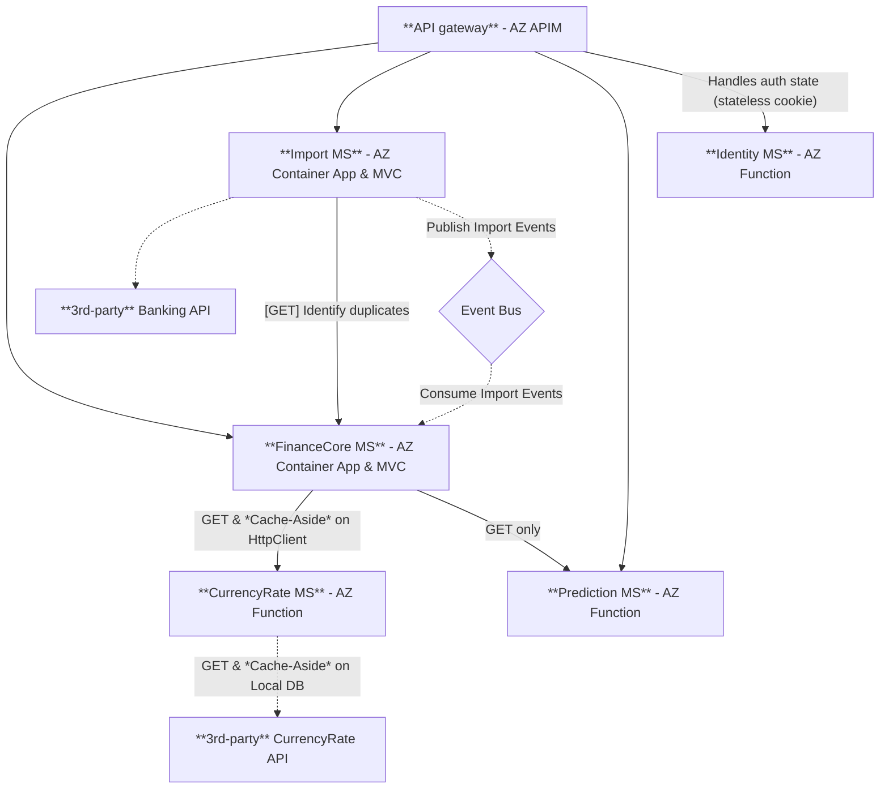

## MoneyCanFly API - MicroServices

This API is a rework of an already working NextJS API [here](https://github.com/armandasalmd/money-can-fly/tree/production/src/pages/api). Existing API idea has been selected for rework as its Business domain creates a well-rounded set of challenges to practice for Microservices architecture (`C#.NET`).

#### Step 1. Breaking down existing monolith

Existing app [here](https://github.com/armandasalmd/money-can-fly/tree/production/src/pages/api) is a full-stack NextJS app running as a server-less (edge) functions on Vercel PaaS. App scales horizontally, by default. On the other hand, the entire NextJS app is 1 big Solution/Project, with mixed up and cross referenced Manager classes, Models, Utilities and so on.

I have been deep thinking about the applicable domain split for Microservices.
Ideally Microservices have to be "reactive" to events (similar to how ReactJS hooks dependency array works). This means, microservices should use asyncronous communication for mutations; and `HTTP` or `gRPC` communication for GETTING information. After 5 iterations of drawings, I came with this picture:

